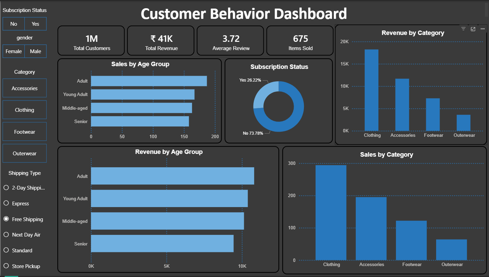
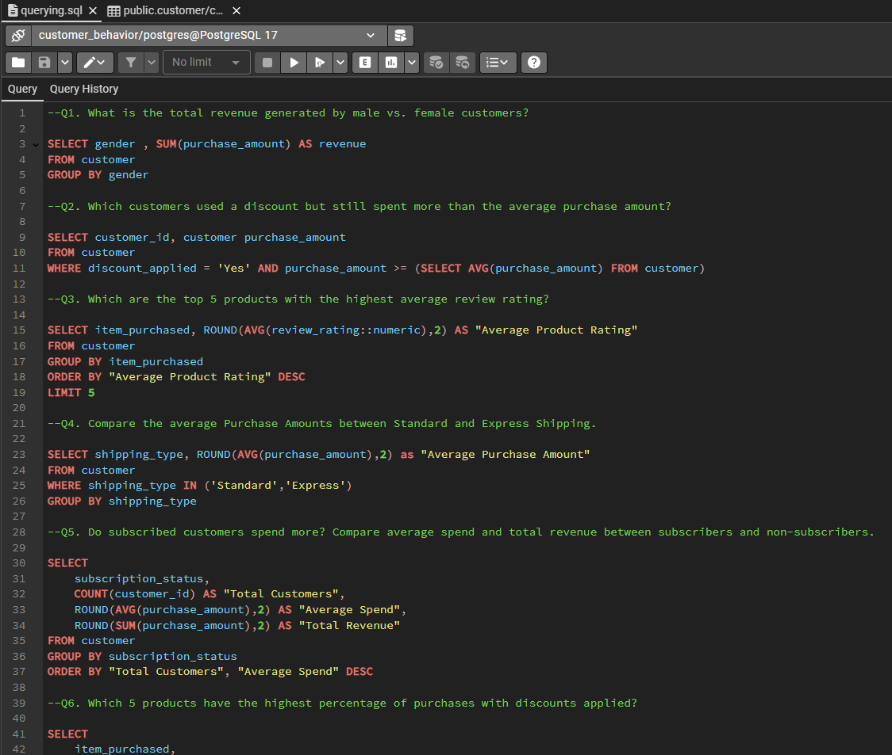
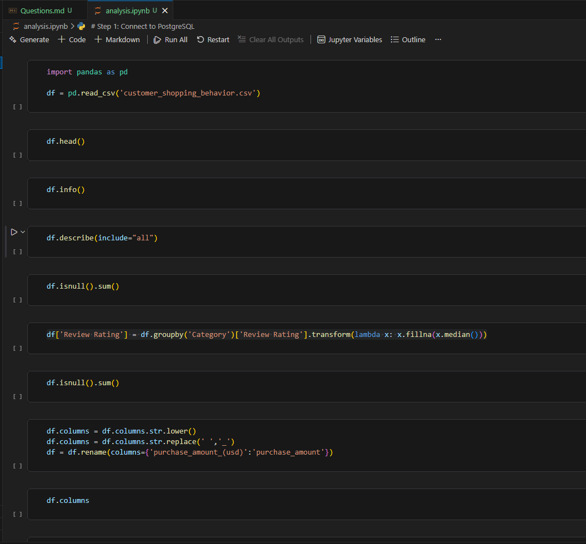

# Customer Shopping Behavior Data Pipeline

A comprehensive data engineering solution for processing, transforming, and warehousing customer shopping behavior data to support retail analytics and business intelligence.

---

## 📋 Table of Contents
- [Project Overview](#project-overview)
- [Architecture](#architecture)
- [Technologies](#technologies)
- [Data Pipeline](#data-pipeline)
- [Project Structure](#project-structure)
- [Setup & Installation](#setup--installation)
- [Data Processing](#data-processing)
- [Data Warehouse](#data-warehouse)
- [Analytics & Visualization](#analytics--visualization)
- [Key Features](#key-features)
- [Usage](#usage)
- [Data Quality & Validation](#data-quality--validation)

---

## 📌 Project Overview

This project implements an end-to-end data engineering pipeline to process and analyze consumer shopping behavior for a retail company. The solution extracts, transforms, and loads (ETL) raw customer transaction data into a structured warehouse, enabling stakeholders to identify trends, optimize marketing strategies, and improve customer engagement.

### Business Objectives
- Understand purchasing patterns across demographics and product categories
- Identify factors driving purchase decisions (discounts, reviews, seasonality, payment methods)
- Detect repeat purchase drivers and customer loyalty indicators
- Support data-driven decision-making through actionable insights

---

## 🏗️ Architecture

```
┌─────────────────────────────────────────────────────────────────┐
│                      Data Sources                               │
│         (Raw Customer Shopping Behavior CSV)                    │
└──────────────────────┬──────────────────────────────────────────┘
                       │
                       ▼
┌─────────────────────────────────────────────────────────────────┐
│              ETL Pipeline (Python)                              │
│  • Data Ingestion & Validation                                  │
│  • Cleaning & Transformation                                    │
│  • Feature Engineering                                          │
│  • Data Enrichment & Imputation                                 │
└──────────────────────┬──────────────────────────────────────────┘
                       │
                       ▼
┌─────────────────────────────────────────────────────────────────┐
│           Data Warehouse / Structured Layer                     │
│  (Cleaned, normalized customer and transaction data)            │
└──────────────────────┬──────────────────────────────────────────┘
                       │
        ┌──────────────┼──────────────┐
        │              │              │
        ▼              ▼              ▼
    ┌────────┐   ┌────────┐   ┌────────────┐
    │  SQL   │   │ Power  │   │ Analytics  │
    │ Queries│   │   BI   │   │  Reports   │
    └────────┘   └────────┘   └────────────┘
```

---

## 🛠️ Technologies

| Component | Technology | Purpose |
|-----------|-----------|---------|
| **Data Processing** | Python 3.x, Pandas, NumPy | ETL, Data transformation, imputation |
| **Data Warehouse** | SQL (relational database) | Structured data storage, querying |
| **Data Quality** | Python validation scripts | Data profiling, anomaly detection |
| **Visualization** | Power BI | Interactive dashboards, insights |
| **Version Control** | Git, GitHub | Source code management |

---

## 📊 Data Pipeline

### **1. Data Ingestion**
- Read raw customer shopping behavior dataset (CSV)
- Validate schema and data types
- Perform initial statistics and data profiling

### **2. Data Cleaning & Transformation**
- Handle missing values using category-specific medians
- Remove duplicates and invalid records
- Standardize date formats and categorical values
- Data type conversion for calculations

### **3. Feature Engineering**
- Derive customer segments based on purchase frequency
- Calculate customer lifetime value (CLV)
- Create seasonal and temporal features
- Aggregate metrics by customer, category, and channel

### **4. Data Enrichment**
- Enrich customer transaction data with behavioral metrics
- Generate fact and dimension tables
- Prepare data for warehouse ingestion

### **5. Data Loading**
- Load transformed data into structured warehouse schema
- Build indexed relational tables for performance
- Enable efficient SQL querying

---

## 📁 Project Structure

```
Customer-Shopping-Behavior-Analysis/
│
├── etl_pipeline.ipynb                    # Main ETL notebook (data processing)
├── warehouse_queries.sql                 # SQL queries for analysis
├── customer_behavior_dashboard.pbix      # Power BI dashboard
│
├── raw_customer_behavior.csv             # Raw data source
│
├── README.md                             # This file
├── ProblemStatement.md                   # Business context and objectives
├── Deliverables.md                       # Project deliverables summary
├── Questions.md                          # Analysis questions
│
├── dashboard_overview.png                # Dashboard overview screenshot
├── sales_analysis.png                    # Sales analysis screenshot
└── customer_insights.png                 # Customer insights screenshot
```

---

## 🚀 Setup & Installation

### Prerequisites
- Python 3.8+
- pandas, NumPy
- SQL database (SQLite, PostgreSQL, MySQL, or SQL Server)
- Power BI Desktop (for dashboard)
- Git

### Installation Steps

1. **Clone the repository**
   ```bash
   git clone https://github.com/hamzakhan0712/Customer-Shopping-Behavior-Analysis.git
   cd Customer-Shopping-Behavior-Analysis
   ```

2. **Install Python dependencies**
   ```bash
   pip install pandas numpy sqlalchemy pyodbc
   ```

3. **Set up the database**
   - Create a new database in your SQL system
   - Update connection strings in ETL scripts if needed

4. **Run the ETL pipeline**
   - Open `etl_pipeline.ipynb` in Jupyter Notebook
   - Execute cells sequentially to process data

---

## 📝 Data Processing

### Key Transformations (etl_pipeline.ipynb)

**Missing Value Imputation:**
```python
# Fill missing Review Ratings with category-specific median
df['Review Rating'] = df.groupby('Category')['Review Rating'].transform(
    lambda x: x.fillna(x.median())
)
```

This approach ensures:
- Category-specific imputation preserves distribution
- Median reduces impact of outliers
- Transform maintains original row structure

### Data Quality Checks
- Null value analysis before and after cleaning
- Duplicate detection
- Data type validation
- Statistical profiling

---

## 🗄️ Data Warehouse

### Schema Design

**Fact Tables:**
- `fact_purchases` – Customer transactions with amounts, discounts, ratings
- `fact_customer_activity` – Purchase frequency and behavior metrics

**Dimension Tables:**
- `dim_customers` – Customer demographics and segments
- `dim_products` – Product categories and attributes
- `dim_channels` – Sales channels (online, offline)
- `dim_time` – Temporal dimensions (date, season, month)

### SQL Queries (warehouse_queries.sql)

Example queries include:
- Customer segmentation by purchase frequency
- Category-level sales analysis
- Channel comparison (online vs. offline)
- Discount impact on repeat purchases
- Seasonal trend analysis

---

## 📊 Analytics & Visualization

### Power BI Dashboard (customer_behavior_dashboard.pbix)

**Key Visuals:**
- Customer purchase trends over time
- Sales by category and channel
- Impact of discounts on purchase behavior
- Review ratings influence on repeat purchases
- Customer segmentation insights
- Seasonal patterns and forecasts

**Interactive Features:**
- Filters by date range, category, channel
- Drill-down capabilities
- KPI cards and trend indicators

### Dashboard Screenshots

#### Overview Dashboard


#### Sales Analysis


#### Customer Insights


---

## ✨ Key Features

✅ **End-to-End ETL Pipeline** – Automated data ingestion, cleaning, and transformation  
✅ **Data Quality Framework** – Validation, profiling, and anomaly detection  
✅ **Scalable Architecture** – Supports incremental data loads and historical data  
✅ **SQL-Optimized Queries** – Efficient warehouse queries for analytics  
✅ **Interactive BI Dashboards** – Real-time insights for stakeholders  
✅ **Modular Code** – Reusable scripts and organized structure  
✅ **Documentation** – Clear comments and data dictionary  

---

## 🎯 Usage

### Running the Pipeline

1. **Data Processing:**
   ```bash
   jupyter notebook etl_pipeline.ipynb
   ```
   Execute all cells to transform raw data.

2. **Warehouse Queries:**
   - Connect to your SQL database
   - Execute queries in `warehouse_queries.sql`
   - Export results for analysis

3. **Dashboarding:**
   - Open `customer_behavior_dashboard.pbix` in Power BI
   - Refresh data connections
   - Share with stakeholders

### Typical Workflow
```
Raw CSV → ETL Processing → Cleaned Data → SQL Warehouse → Power BI Dashboard
```

---

## 🔍 Data Quality & Validation

### Validation Checks
- **Schema validation** – Data types match expected schema
- **Completeness** – Acceptable null value thresholds per field
- **Uniqueness** – No unintended duplicates in keys
- **Consistency** – Values within valid ranges
- **Referential integrity** – Foreign keys reference valid records

### Monitoring
- Track data volume and row counts pre/post transformation
- Monitor missing value patterns
- Flag outliers and anomalies
- Document data lineage

---

## 📈 Business Insights

This data pipeline enables stakeholders to:
- **Identify high-value customer segments** for targeted marketing
- **Optimize pricing strategies** based on discount impact analysis
- **Improve product assortment** by category performance
- **Enhance channel strategy** through online vs. offline comparison
- **Predict repeat purchase probability** using historical patterns
- **Detect seasonal trends** for inventory and marketing planning

---

## 📧 Contact & Support

For questions or issues with this data engineering project, please open an issue on GitHub or contact the project maintainer.

---

## 📄 License

This project is provided as-is for educational and business analysis purposes.

---

**Last Updated:** March 28, 2026  
**Repository:** [Customer-Shopping-Behavior-Analysis](https://github.com/hamzakhan0712/Customer-Shopping-Behavior-Analysis)
